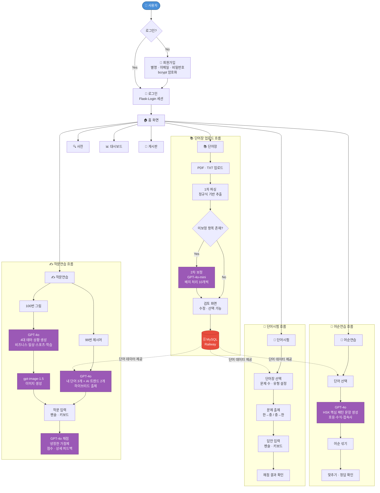

```mermaid
flowchart TD
    User([👤 사용자]) --> Auth{로그인?}

    Auth -->|No| Register["📝 회원가입<br/>별명 · 이메일 · 비밀번호<br/>bcrypt 암호화"]
    Register --> Login
    Auth -->|Yes| Login["🔐 로그인<br/>Flask-Login 세션"]
    Login --> Home["🏠 홈 화면"]

    Home --> A["📚 단어장"]
    Home --> B["🧪 단어시험"]
    Home --> C["🔀 어순연습"]
    Home --> D["✍️ 작문연습"]
    Home --> E["🔍 사전"]
    Home --> F["📊 대시보드"]
    Home --> G["💬 게시판"]

    subgraph VOCAB ["📚 단어장 업로드 흐름"]
        A --> A1["PDF · TXT 업로드"]
        A1 --> A2["1차 파싱<br/>정규식 기반 추출"]
        A2 --> A3{미보정 항목 존재?}
        A3 -->|Yes| A4["2차 보정<br/>GPT-4o-mini<br/>배치 처리 10개씩"]
        A3 -->|No| A5
        A4 --> A5["검토 화면<br/>수정 · 선택 가능"]
        A5 --> DB[("🗄️ MySQL<br/>Railway")]
    end

    subgraph QUIZ ["🧪 단어시험 흐름"]
        B --> B1["단어장 선택<br/>문제 수 · 유형 설정"]
        B1 --> B2["문제 출제<br/>한→중 / 중→한"]
        B2 --> B3["답안 입력<br/>펜슬 · 키보드"]
        B3 --> B4["채점 결과 확인"]
    end

    subgraph WORD ["🔀 어순연습 흐름"]
        C --> C1["단어 선택"]
        C1 --> C2["GPT-4o<br/>HSK 핵심 패턴 문장 생성<br/>호응·수식·접속사"]
        C2 --> C3["어순 섞기"]
        C3 --> C4["맞추기 · 정답 확인"]
    end

    subgraph WRITING ["✍️ 작문연습 흐름"]
        D --> D1["99번 제시어"]
        D --> D2["100번 그림"]
        D1 --> D3["GPT-4o<br/>내 단어 3개 + AI 트렌드 2개<br/>하이브리드 출제"]
        D2 --> D4["GPT-4o<br/>4대 테마 상황 생성<br/>비즈니스·일상·스포츠·학습"]
        D4 --> D5["gpt-image-1.5<br/>이미지 생성"]
        D3 --> D6["작문 입력<br/>펜슬 · 키보드"]
        D5 --> D6
        D6 --> D7["GPT-4o 채점<br/>냉정한 가점제<br/>점수 · 상세 피드백"]
    end

    DB -.->|단어 데이터 제공| B1
    DB -.->|단어 데이터 제공| C1
    DB -.->|단어 데이터 제공| D3

    classDef aiNode fill:#9B59B6,stroke:#6C3483,color:#fff
    classDef dbNode fill:#E74C3C,stroke:#A93226,color:#fff
    classDef userNode fill:#4A90D9,stroke:#2C5F8A,color:#fff

    class A4,C2,D3,D4,D5,D7 aiNode
    class DB dbNode
    class User userNode
```
